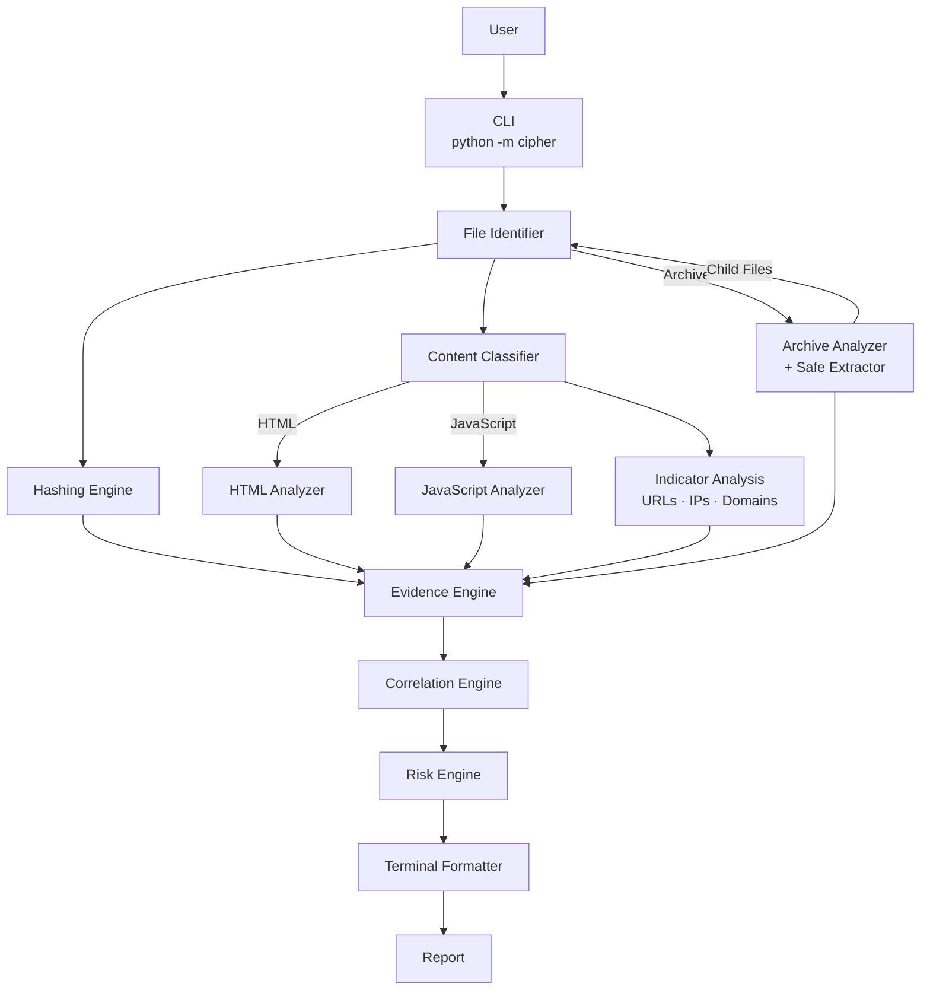
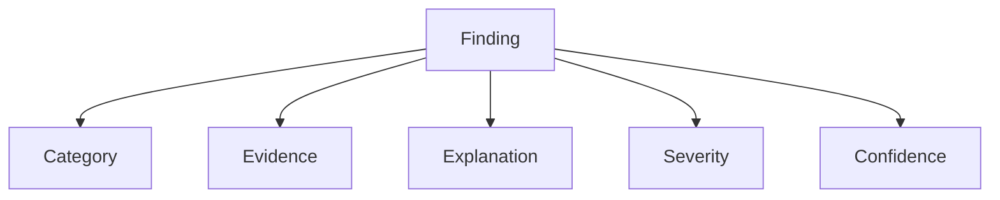
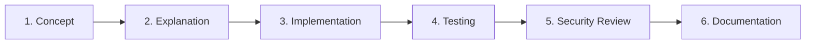

<p align="center">
  
</p>

<p align="center">
  
</p>

<p align="center">
  
  
  
</p>

<p align="center">
  
  
  
  
  
  
</p>

<p align="center">
  Nexorium-Cipher is a multi-platform static threat and malware analysis toolkit focused on <b>explainable security findings</b>.
</p>

---

## 📑 Table of Contents

- [📖 Overview](#overview)
- [🚦 Current Status](#current-status)
- [🚀 Installation & Usage](#installation--usage)
- [💻 Examples](#examples)
- [🏗️ Project Architecture](#project-architecture)
- [🧪 Testing](#testing)
- [🧩 Explainable Findings](#explainable-findings)
- [🗂️ Planned Analysis Capabilities](#planned-analysis-capabilities)
- [🔮 Future Detection & Analysis](#future-detection--analysis)
- [🎓 Learning Objectives](#learning-objectives)
- [🧠 Development Philosophy](#development-philosophy)
- [🗺️ Roadmap](#roadmap)
- [⚠️ Disclaimer](#disclaimer)
- [📜 License](#license)

---

## 📖 Overview

The goal is simple:

> Give Cipher an unknown file and make it explain what the file is, what it contains, what it may be capable of, and why a finding may be suspicious.

Cipher is being developed incrementally as both a cybersecurity learning project and a practical security-analysis toolkit.

---

## 🚦 Current Status

### Phase 1 — Foundation &nbsp;

Phase 1 is complete. Cipher now runs as a real interactive application (`python -m cipher`) rather than a development script, and produces a full, explainable investigation report for any file you give it.

<p align="left">
              
</p>

Cipher currently identifies file formats using magic-byte/file-signature detection (PDF, PNG, ZIP, EXE, JPEG, GIF) and compares the detected format against the file's extension:

| Status | Meaning |
|---|---|
| `MATCH` | The file extension agrees with the detected file format. |
| `MISMATCH` | The file extension does not agree with the detected file format. |
| `UNKNOWN` | Cipher could not identify the file format using its current signature database. |

**Important:** `MATCH` does not prove a file is safe. `MISMATCH` does not prove a file is malicious. `UNKNOWN` does not prove a file is malicious either. These are observations from the current file-identification layer, not a verdict — they may warrant further investigation.

### Phase 2 — Static Content Analysis &nbsp;

Phase 2 is complete. Cipher can now read and analyze text-based file content — HTML, JavaScript, and plain text/Python — instead of only identifying the file format. It classifies what it's looking at, then extracts security-relevant indicators from it.

<p align="left">
     
</p>

<details>
<summary><b>📄 Generic Content Analysis</b></summary>
<br/>

- Text vs. binary classification
- UTF-8 text reading
- Content statistics (character, line, and word counts)
- Empty-content detection
- Content type detection (plain text, Python, HTML, JavaScript)

</details>

<details>
<summary><b>🌐 Network Indicator Analysis</b></summary>
<br/>

- HTTP/HTTPS URL extraction
- WS/WSS URL extraction (JavaScript)
- IPv4 address extraction
- Domain extraction
- Structured network-indicator findings

</details>

<details>
<summary><b>🧾 HTML Analysis</b></summary>
<br/>

- Forms, password inputs, hidden inputs
- Script tags and external JavaScript sources
- Form actions and methods
- Form-destination analysis (HTTP, HTTPS, IP-based, relative, and unusual schemes)
- Iframes, images, and links — including external and unusual-scheme variants
- Structured HTML security findings

</details>

<details>
<summary><b>⚙️ JavaScript Analysis</b></summary>
<br/>

- Named, anonymous, and arrow functions; variables
- Browser, DOM, and console APIs
- Input-value access and event handlers, including user-input collection and form-submission events
- Network APIs, browser storage, and cookie access
- Dynamic code execution, plus HTTP/HTTPS and WS/WSS URLs
- Sensitive-data references
- Structured JavaScript findings

</details>

<details>
<summary><b>🕵️ JavaScript Obfuscation Analysis</b></summary>
<br/>

- Long strings, tracked separately from other evidence
- Hex escapes, Unicode escapes, and Base64-like strings
- Encoded-string counting
- Obfuscation score and overall assessment

**Note:** long strings alone are not treated as sufficient evidence of obfuscation. This was an intentional design choice to reduce false positives — obfuscation is only flagged when several corroborating indicators appear together.

</details>

### Phase 3 — Evidence Correlation &nbsp;

Phase 3 is complete. Cipher no longer treats every finding as an isolated data point — related findings are now correlated into higher-level, composite findings that describe a behavioral pattern rather than a single observation.

<p align="left">
      
</p>

For example, Cipher can correlate independently observed indicators — user-input/value access, a sensitive-data reference, network communication, and an external destination — into a single higher-level finding describing a potential credential/data-transmission pattern, rather than reporting each observation on its own.

| Type | What it represents |
|---|---|
| Individual finding | A single piece of evidence from one analyzer. |
| Correlated finding | Multiple related pieces of evidence combined into one behavioral observation. |

Correlated findings are also deduplicated, so the same underlying behavior isn't reported more than once across analyzers.

### Phase 4 — Risk Engine &nbsp;

Phase 4 is complete. Instead of a bare `MALWARE: YES`, Cipher now includes a dedicated risk engine that produces an overall, explainable risk assessment for the file as a whole.

<p align="left">
      
</p>

The risk engine calculates a score by weighing each finding's severity and confidence, factoring in correlated findings, and tracking which specific findings contributed most to the result — so the overall assessment stays traceable back to individual evidence instead of becoming a black box.

**Important:** the risk engine's overall assessment — and the confidence behind it — is still not a certainty of malware. It describes how strongly the combined, explainable evidence points toward risk, not a guarantee.

### Phase 5 — Archive Analysis &nbsp;

Phase 5 is complete. Cipher can now analyze ZIP archives — not just the archive file itself, but what's inside it.

<p align="left">
      
</p>

<details>
<summary><b>📦 Archive Inspection</b></summary>
<br/>

- ZIP archive identification
- Archive entry listing (files and directories)
- File and directory counting
- Suspicious file-extension detection inside archives
- Executable detection inside archives
- Script detection inside archives
- Nested-archive detection, with recursive analysis of nested archives

</details>

<details>
<summary><b>🛡️ Safe Extraction</b></summary>
<br/>

- Extraction to temporary directories
- Chunked extraction
- Archive path-traversal detection
- Absolute-path detection
- Extraction entry-count limits
- Maximum extracted-size limits

</details>

<details>
<summary><b>🔗 Archive-Aware Analysis</b></summary>
<br/>

- Analysis of individual child files inside an archive
- Promotion of important child findings up to the parent archive finding
- Archive-aware finding deduplication
- Behavioral correlation within archive contents
- Risk scoring of archive findings
- Structured archive security findings

</details>

Archive analysis is currently focused on the ZIP format — support for other archive/container formats is planned (see [Planned Analysis Capabilities](#planned-analysis-capabilities)).

---

## 🚀 Installation & Usage

**Requirements:**
- Python 3.x
- No external Python dependencies are currently required for Phases 1–5.

**Run Cipher:**

```
python -m cipher
```

Cipher will prompt you for a file path:

```
Enter file path:
```

Both relative and absolute paths are supported, including paths containing spaces — you do not need to modify any Python source code to analyze a different file.

Example:

```
python -m cipher

Enter file path: C:\Users\User\Downloads\My Suspicious File.zip
```

Cipher will then analyze the file and display a full, formatted investigation report.

---

## 💻 Examples

### File-signature mismatch

```
python -m cipher

Enter file path: fake.pdf
```

```
TARGET
File          : fake.pdf
Size          : 128 bytes

IDENTIFICATION
Extension     : pdf
Detected      : zip
Valid Ext.    : ['zip']
Status        : ⚠ [MISMATCH]

FINDINGS (1)

01  [LOW] Extension mismatch
Category   : File Identification
Confidence : [HIGH]

Evidence:
  Extension 'pdf' does not match detected format 'zip'.

Explanation:
  The file extension does not match the detected file format.
  This may be benign, accidental, or potentially suspicious.
```

Invalid input is handled cleanly:

```
Enter file path: missing.txt
ERROR: File not found.
```

or:

```
Enter file path: C:\Users\User\Downloads
ERROR: The supplied path is a directory.
Please provide a file.
```

### HTML form analysis

```
python -m cipher

Enter file path: login.html
```

```
FINDINGS (2)

01  [MEDIUM] Password input detected
Category   : HTML Analysis
Confidence : [HIGH]

Evidence:
  <input type="password" name="pwd">

Explanation:
  The page contains a password input field, indicating a
  login or credential-collection form.

02  [HIGH] Form submits to an external, IP-based destination
Category   : HTML Analysis
Confidence : [MEDIUM]

Evidence:
  <form action="http://185.12.44.9/collect.php" method="POST">

Explanation:
  The form submits captured input over plain HTTP to an
  IP-based destination rather than the page's own domain —
  a pattern often seen on credential-harvesting pages.
```

### JavaScript static analysis

```
python -m cipher

Enter file path: payload.js
```

```
FINDINGS (2)

01  [MEDIUM] Dynamic code execution
Category   : JavaScript Analysis
Confidence : [HIGH]

Evidence:
  eval(atob("ZnVuY3Rpb24oKXsgLi4uIH0="))

Explanation:
  The script decodes a string at runtime and passes it to
  eval(). This is a static-analysis observation about code
  structure — Cipher does not execute the script.

02  [LOW] Obfuscation indicators present
Category   : JavaScript Analysis
Confidence : [MEDIUM]

Evidence:
  3 Base64-like strings, 2 hex-escaped sequences

Explanation:
  Multiple encoded-string patterns were found alongside
  dynamic execution. On their own, encoded strings are not
  proof of malicious intent, but combined with eval() usage
  they raise the overall concern level.
```

**Note:** "dynamic code execution" here means Cipher has statically detected constructs such as `eval()`, `new Function()`, or string-based timers in the source. Cipher does not run or execute the analyzed file — actual dynamic/behavioral execution analysis is future work (see [Roadmap](#roadmap)).

### Archive analysis

```
python -m cipher

Enter file path: bundle.zip
```

```
FINDINGS (3)

01  [MEDIUM] Executable found inside archive
Category   : Archive Analysis
Confidence : [HIGH]

Evidence:
  bundle.zip -> payload.exe

Explanation:
  The archive contains an executable file. This is not
  inherently malicious, but executables inside archives
  warrant further investigation.

02  [MEDIUM] Nested archive detected
Category   : Archive Analysis
Confidence : [HIGH]

Evidence:
  bundle.zip -> inner.zip

Explanation:
  The archive contains another archive. Cipher recursively
  analyzed the nested archive's contents.

03  [HIGH] Archive path traversal detected
Category   : Archive Analysis
Confidence : [HIGH]

Evidence:
  Entry path "../../etc/passwd" would extract outside the
  target directory.

Explanation:
  This entry's resolved path attempts to escape the
  extraction directory.
```

**Note:** the path-traversal entry above is blocked before extraction — Cipher validates that each entry's resolved path stays inside the extraction directory before anything is written to disk.

---

## 🏗️ Project Architecture

The project is a modular Python package with a clear separation between analysis and presentation.

```
Nexorium-Cipher/
│
├── assets/
│   └── banner-cipher.svg
│
├── cipher/
│   ├── __init__.py
│   ├── __main__.py
│   ├── cli.py
│   │
│   └── core/
│       ├── analyzer.py
│       ├── hashing.py
│       ├── file_identifier.py
│       ├── evidence.py
│       ├── formatter.py
│       ├── archive_analyzer.py
│       ├── archive_extractor.py
│       ├── archive_pipeline.py
│       │
│       ├── content/
│       │   ├── content_analyzer.py
│       │   ├── content_reader.py
│       │   ├── content_classifier.py
│       │   ├── content_stats.py
│       │   └── content_type_detector.py
│       │
│       ├── network/
│       │   ├── indicators.py
│       │   └── indicator_analysis.py
│       │
│       ├── html/
│       │   ├── html_analyzer.py
│       │   └── html_analysis.py
│       │
│       └── javascript/
│           ├── javascript_analyzer.py
│           └── javascript_analysis.py
│
├── tests/
│   ├── test_hashing.py
│   ├── test_evidence.py
│   ├── test_identifier.py
│   └── ... (additional analyzer, correlation, risk-engine, and archive tests)
│
├── README.md
├── .gitignore
└── LICENSE
```

*Visual summary of the analysis flow:*



The formatter is a presentation layer only — it renders the result that the identification, hashing, content-analysis, correlation, and risk-engine modules already produced, and never performs analysis itself.

The files inside `tests/` are development/testing scripts, not the normal way to run Cipher — for everyday use, run `python -m cipher`.

The architecture will expand as additional analysis capabilities are implemented.

---

## 🧪 Testing

Meaningful features are validated by running them through the main Cipher CLI (`python -m cipher`) against a set of controlled test files — deliberately mismatched extensions, sample HTML forms, JavaScript snippets built to exercise specific analyzers (obfuscated strings, `eval()` usage, credential-harvesting form patterns), and archive files built to exercise the Phase 5 pipeline: a normal archive containing an executable/script/nested archive, a credential/data-transmission archive, a benign archive, a path-traversal archive, an absolute-path archive, and archives exceeding the maximum entry count or maximum extracted-size limit. The scripts in `tests/` support this during development.

Regression testing after adding archive support confirmed that the existing hashing, identification, content-analysis, and correlation capabilities continued to work as expected.

This is functional validation of the analyzers, not a production malware sandbox — Cipher does not yet run samples in an isolated dynamic-analysis environment. That's planned for a later phase (see [Roadmap](#roadmap)).

---

## 🧩 Explainable Findings

A major design goal of Cipher is to avoid simply producing:

```
MALWARE: YES
```

Instead, Cipher produces structured findings containing:

```
Finding
├── Category
├── Evidence
├── Explanation
├── Severity
└── Confidence
```

*Visual summary of the same structure:*



For example:

| Field | Value |
|---|---|
| Finding | Dynamic code loading |
| Evidence | `DexClassLoader` |
| Explanation | The application contains an API capable of dynamically loading executable code. |
| Severity | 🔴 HIGH |
| Confidence | 🟢 HIGH |

This approach is intended to make analysis results easier to understand and investigate.

**Severity** describes how significant or potentially impactful a finding may be. **Confidence** describes how strongly the currently available evidence supports that specific observation — it is not a probability that the file is malware, and a `HIGH` confidence finding does not mean the file is definitely malicious.

An individual finding is an observation about one piece of evidence, not an overall verdict on the file. Cipher now correlates related findings into higher-level, evidence-backed behavioral observations (Phase 3), and combines the full set of findings — individual and correlated — into an overall, explainable risk assessment through the risk engine (Phase 4). That overall assessment describes how strongly the combined evidence points toward risk; it is still not a certainty of malware.

---

## 🗂️ Planned Analysis Capabilities

The project will eventually expand to support additional file and archive formats.

<details>
<summary><b>📦 Archives</b></summary>
<br/>

ZIP archive analysis is now implemented — see [Current Status](#current-status) and [Roadmap](#roadmap) (Phase 5).

Remaining planned archive-format support:

- RAR, 7z, and TAR container formats
- ISO/disk-image containers

</details>

<details>
<summary><b>🤖 Android APK</b></summary>
<br/>

- Android Manifest analysis
- Permissions
- Activities
- Services
- Broadcast receivers
- Exported components
- DEX analysis
- Native libraries
- Certificates
- Package metadata
- URLs and domains
- Suspicious APIs
- Obfuscation indicators
- Dynamic code loading indicators

</details>

<details>
<summary><b>🪟 Windows PE</b></summary>
<br/>

- PE headers
- Sections
- Imports / exports
- Resources
- Strings
- Entropy
- Digital signatures
- Suspicious APIs
- Packer indicators

</details>

<details>
<summary><b>🐧 Linux ELF</b></summary>
<br/>

- ELF headers
- Sections
- Symbols
- Shared libraries
- Strings
- Imports
- Suspicious functions

</details>

---

## 🔮 Future Detection & Analysis

Future versions are planned to include:

<p align="left">
      
</p>

Dynamic analysis may be introduced later using isolated environments such as dedicated virtual machines or Android emulators.

Unknown or potentially malicious samples should **never be executed on a normal everyday system**.

---

## 🎓 Learning Objectives

Nexorium-Cipher is also a hands-on cybersecurity learning project.

Topics covered during development include:

<table>
<tr><td width="50%">

- Hashing
- Cryptography
- Encryption vs hashing
- Encoding
- File formats
- File fingerprints
- Static analysis
- Dynamic analysis
- Malware triage
- Indicators of Compromise

</td><td width="50%">

- Evidence analysis
- Risk scoring
- Confidence scoring
- Obfuscation
- Packing
- Persistence concepts
- Network indicators
- False positives and false negatives
- Safe malware-analysis practices
- Git and GitHub project management

</td></tr>
</table>

A complete reference document will be created during development to document the concepts learned and provide a quick revision guide.

---

## 🧠 Development Philosophy

Cipher is intentionally being developed **one capability at a time**.

Each feature is designed to include:

1. Cybersecurity concept
2. Technical explanation
3. Python implementation
4. Testing
5. Security considerations
6. Documentation

*Visual summary of the same pipeline:*



The objective is to understand how each component works rather than simply assembling existing tools.

---

## 🗺️ Roadmap

<p align="left">
  
  
</p>

<details open>
<summary><b>✅ Phase 1 — Foundation</b> &nbsp;</summary>
<br/>

- [x] Modular Python package structure (`cipher/` + `core/`)
- [x] Interactive CLI (`python -m cipher`)
- [x] File path input (relative, absolute, paths with spaces)
- [x] File existence & directory validation
- [x] File metadata extraction (size, extension, timestamps)
- [x] Chunked file hashing (MD5 / SHA-1 / SHA-256)
- [x] Magic-byte file-signature identification (PDF, PNG, ZIP, EXE, JPEG, GIF)
- [x] Extension validation (MATCH / MISMATCH / UNKNOWN)
- [x] Explainable evidence engine with structured findings
- [x] Custom terminal formatter & branding

</details>

<details open>
<summary><b>✅ Phase 2 — Static Content Analysis</b> &nbsp;</summary>
<br/>

- [x] Generic content analysis (text/binary classification, content statistics, content-type detection)
- [x] Network indicator extraction (URLs, IPs, domains)
- [x] HTML analysis (forms, password/hidden inputs, external scripts, iframes, form-destination analysis)
- [x] JavaScript analysis (functions, variables, browser/DOM APIs, event handlers, network APIs, storage/cookie access, dynamic code execution)
- [x] JavaScript obfuscation scoring (hex/Unicode escapes, Base64-like strings, false-positive-aware scoring)
- [x] Structured findings across all of the above

</details>

<details open>
<summary><b>✅ Phase 3 — Evidence Correlation</b> &nbsp;</summary>
<br/>

- [x] Evidence correlation across findings
- [x] Related-indicator grouping
- [x] Behavioral-pattern detection
- [x] Composite findings
- [x] Evidence chains
- [x] Finding deduplication
- [x] Improved severity calibration
- [x] Improved confidence calibration
- [x] Cross-analyzer correlation

</details>

<details open>
<summary><b>✅ Phase 4 — Risk Engine</b> &nbsp;</summary>
<br/>

- [x] Overall risk score calculation
- [x] Overall risk assessment
- [x] Assessment confidence calculation
- [x] Risk-factor identification
- [x] Per-finding contribution tracking
- [x] Severity- and confidence-weighted scoring
- [x] Correlation-aware risk scoring
- [x] Explainable risk scoring (no bare "MALWARE: YES" verdict)

</details>

<details open>
<summary><b>✅ Phase 5 — Archive Analysis</b> &nbsp;</summary>
<br/>

- [x] ZIP archive identification and entry inspection (file/directory counts, suspicious extensions)
- [x] Executable and script detection inside archives
- [x] Nested-archive detection with recursive analysis
- [x] Safe extraction to temporary directories with chunked reads
- [x] Archive path-traversal and absolute-path detection
- [x] Extraction entry-count and maximum-size limits
- [x] Per-child-file analysis with promotion of key findings to the parent archive
- [x] Archive-aware finding deduplication and behavioral correlation
- [x] Risk scoring of archive findings
- [x] Structured archive security findings

</details>

<details open>
<summary><b>🔜 Phase 6 — Android APK Analysis</b> &nbsp;</summary>
<br/>

- [ ] Android Manifest analysis
- [ ] Permissions
- [ ] Activities
- [ ] Services
- [ ] Broadcast receivers
- [ ] Exported components
- [ ] DEX analysis
- [ ] Native libraries
- [ ] Certificates
- [ ] Package metadata
- [ ] URLs and domains
- [ ] Suspicious APIs
- [ ] Obfuscation indicators
- [ ] Dynamic code loading indicators

</details>

<details>
<summary><b>🔮 Later Roadmap</b> &nbsp;</summary>
<br/>

- [ ] Phase 7 — Windows PE Analysis
- [ ] Phase 8 — Linux ELF Analysis
- [ ] Phase 9 — Reporting (JSON / HTML)
- [ ] Phase 10 — Dynamic Analysis
- [ ] Phase 11 — Final Correlation & Hardening

</details>

---

## ⚠️ Disclaimer

Nexorium-Cipher is intended for **educational, defensive, and authorized security analysis**.

Only analyze files and systems that you own or have explicit permission to analyze.

Potentially malicious samples should be handled in isolated environments with appropriate safety precautions.

---

## 📜 License

This project is licensed under the **MIT License**.

---

## 👤 Author

<p align="center">
<b>Daniyal Janjua</b><br/>
Cybersecurity Student · SOC Analyst Aspirant
</p>

<p align="center">
  <a href="https://github.com/daniyal-sec">
    
  </a>
  <a href="https://github.com/daniyal-sec">
    
  </a>
</p>

<p align="center">
  <sub>Static Malware Analysis · Hashing · Explainable Security Findings</sub>
</p>