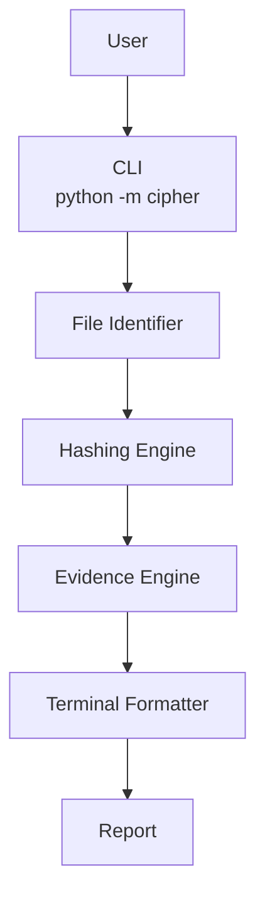
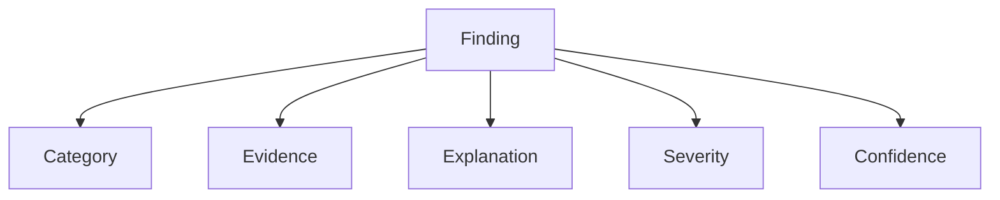
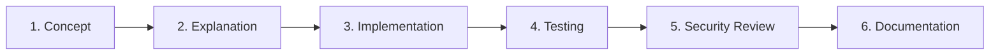

<p align="center">
  
</p>

<p align="center">
  
</p>

<p align="center">
  
  
  
</p>

<p align="center">
  
  
  
  
  
  
</p>

<p align="center">
  Nexorium-Cipher is a multi-platform static threat and malware analysis toolkit focused on <b>explainable security findings</b>.
</p>

---

## 📑 Table of Contents

- [📖 Overview](#overview)
- [🚦 Current Status](#current-status)
- [🚀 Installation & Usage](#installation--usage)
- [💻 Example](#example)
- [🏗️ Project Architecture](#project-architecture)
- [🧩 Explainable Findings](#explainable-findings)
- [🗂️ Planned Analysis Capabilities](#planned-analysis-capabilities)
- [🔮 Future Detection & Analysis](#future-detection--analysis)
- [🎓 Learning Objectives](#learning-objectives)
- [🧠 Development Philosophy](#development-philosophy)
- [🗺️ Roadmap](#roadmap)
- [⚠️ Disclaimer](#disclaimer)
- [📜 License](#license)

---

## 📖 Overview

The goal is simple:

> Give Cipher an unknown file and make it explain what the file is, what it contains, what it may be capable of, and why a finding may be suspicious.

Cipher is being developed incrementally as both a cybersecurity learning project and a practical security-analysis toolkit.

---

## 🚦 Current Status

### Phase 1 — Foundation &nbsp;

Phase 1 is complete. Cipher now runs as a real interactive application (`python -m cipher`) rather than a development script, and produces a full, explainable investigation report for any file you give it.

<p align="left">
              
</p>

Cipher currently identifies file formats using magic-byte/file-signature detection (PDF, PNG, ZIP, EXE, JPEG, GIF) and compares the detected format against the file's extension:

| Status | Meaning |
|---|---|
| `MATCH` | The file extension agrees with the detected file format. |
| `MISMATCH` | The file extension does not agree with the detected file format. |
| `UNKNOWN` | Cipher could not identify the file format using its current signature database. |

**Important:** `MATCH` does not prove a file is safe. `MISMATCH` does not prove a file is malicious. `UNKNOWN` does not prove a file is malicious either. These are observations from the current file-identification layer, not a verdict — they may warrant further investigation.

---

## 🚀 Installation & Usage

**Requirements:**
- Python 3.x
- No external Python dependencies are currently required for Phase 1.

**Run Cipher:**

```
python -m cipher
```

Cipher will prompt you for a file path:

```
Enter file path:
```

Both relative and absolute paths are supported, including paths containing spaces — you do not need to modify any Python source code to analyze a different file.

Example:

```
python -m cipher

Enter file path: C:\Users\User\Downloads\My Suspicious File.zip
```

Cipher will then analyze the file and display a full, formatted investigation report.

---

## 💻 Example

```
python -m cipher

Enter file path: fake.pdf
```

```
TARGET
File          : fake.pdf
Size          : 128 bytes

IDENTIFICATION
Extension     : pdf
Detected      : zip
Valid Ext.    : ['zip']
Status        : ⚠ [MISMATCH]

FINDINGS (1)

01  [LOW] Extension mismatch
Category   : File Identification
Confidence : [HIGH]

Evidence:
  Extension 'pdf' does not match detected format 'zip'.

Explanation:
  The file extension does not match the detected file format.
  This may be benign, accidental, or potentially suspicious.
```

Invalid input is handled cleanly:

```
Enter file path: missing.txt
ERROR: File not found.
```

or:

```
Enter file path: C:\Users\User\Downloads
ERROR: The supplied path is a directory.
Please provide a file.
```

---

## 🏗️ Project Architecture

The project is now a modular Python package with a clear separation between analysis and presentation.

```
Nexorium-Cipher/
│
├── assets/
│   └── banner-cipher.svg
│
├── cipher/
│   ├── __init__.py
│   ├── __main__.py
│   ├── cli.py
│   │
│   └── core/
│       ├── hashing.py
│       ├── file_identifier.py
│       ├── evidence.py
│       └── formatter.py
│
├── tests/
│   ├── test_hashing.py
│   ├── test_evidence.py
│   └── test_identifier.py
│
├── README.md
├── .gitignore
└── LICENSE
```

*Visual summary of the analysis flow:*



The formatter is a presentation layer only — it renders the result that `file_identifier.py`, `hashing.py`, and `evidence.py` already produced, and never performs analysis itself.

The files inside `tests/` are development/testing scripts, not the normal way to run Cipher — for everyday use, run `python -m cipher`.

The architecture will expand as additional analysis capabilities are implemented.

---

## 🧩 Explainable Findings

A major design goal of Cipher is to avoid simply producing:

```
MALWARE: YES
```

Instead, Cipher should eventually produce structured findings containing:

```
Finding
├── Category
├── Evidence
├── Explanation
├── Severity
└── Confidence
```

*Visual summary of the same structure:*



For example:

| Field | Value |
|---|---|
| Finding | Dynamic code loading |
| Evidence | `DexClassLoader` |
| Explanation | The application contains an API capable of dynamically loading executable code. |
| Severity | 🔴 HIGH |
| Confidence | 🟢 HIGH |

This approach is intended to make analysis results easier to understand and investigate.

**Severity** describes how significant or potentially impactful a finding may be. **Confidence** describes how strongly the currently available evidence supports that specific observation — it is not a probability that the file is malware, and a `HIGH` confidence finding does not mean the file is definitely malicious.

---

## 🗂️ Planned Analysis Capabilities

The project will eventually expand to support multiple file and application formats.

<details>
<summary><b>🌐 Web / JavaScript</b></summary>
<br/>

- HTML analysis
- JavaScript analysis
- External URLs
- Redirect indicators
- Suspicious JavaScript constructs
- Credential collection indicators
- Obfuscation detection
- Network communication indicators

</details>

<details>
<summary><b>🤖 Android APK</b></summary>
<br/>

- Android Manifest analysis
- Permissions
- Activities
- Services
- Broadcast receivers
- Exported components
- DEX analysis
- Native libraries
- Certificates
- Package metadata
- URLs and domains
- Suspicious APIs
- Obfuscation indicators
- Dynamic code loading indicators

</details>

<details>
<summary><b>🪟 Windows PE</b></summary>
<br/>

- PE headers
- Sections
- Imports / exports
- Resources
- Strings
- Entropy
- Digital signatures
- Suspicious APIs
- Packer indicators

</details>

<details>
<summary><b>🐧 Linux ELF</b></summary>
<br/>

- ELF headers
- Sections
- Symbols
- Shared libraries
- Strings
- Imports
- Suspicious functions

</details>

---

## 🔮 Future Detection & Analysis

Future versions are planned to include:

<p align="left">
           
</p>

Dynamic analysis may be introduced later using isolated environments such as dedicated virtual machines or Android emulators.

Unknown or potentially malicious samples should **never be executed on a normal everyday system**.

---

## 🎓 Learning Objectives

Nexorium-Cipher is also a hands-on cybersecurity learning project.

Topics covered during development include:

<table>
<tr><td width="50%">

- Hashing
- Cryptography
- Encryption vs hashing
- Encoding
- File formats
- File fingerprints
- Static analysis
- Dynamic analysis
- Malware triage
- Indicators of Compromise

</td><td width="50%">

- Evidence analysis
- Risk scoring
- Confidence scoring
- Obfuscation
- Packing
- Persistence concepts
- Network indicators
- False positives and false negatives
- Safe malware-analysis practices
- Git and GitHub project management

</td></tr>
</table>

A complete reference document will be created during development to document the concepts learned and provide a quick revision guide.

---

## 🧠 Development Philosophy

Cipher is intentionally being developed **one capability at a time**.

Each feature is designed to include:

1. Cybersecurity concept
2. Technical explanation
3. Python implementation
4. Testing
5. Security considerations
6. Documentation

*Visual summary of the same pipeline:*



The objective is to understand how each component works rather than simply assembling existing tools.

---

## 🗺️ Roadmap

<p align="left">

</p>

<details open>
<summary><b>✅ Phase 1 — Foundation</b> &nbsp;</summary>
<br/>

- [x] Modular Python package structure (`cipher/` + `core/`)
- [x] Interactive CLI (`python -m cipher`)
- [x] File path input (relative, absolute, paths with spaces)
- [x] File existence & directory validation
- [x] File metadata extraction (size, extension, timestamps)
- [x] Chunked file hashing (MD5 / SHA-1 / SHA-256)
- [x] Magic-byte file-signature identification (PDF, PNG, ZIP, EXE, JPEG, GIF)
- [x] Extension validation (MATCH / MISMATCH / UNKNOWN)
- [x] Explainable evidence engine with structured findings
- [x] Custom terminal formatter & branding

</details>

<details open>
<summary><b>🔜 Phase 2 — Static Content Analysis</b> &nbsp;</summary>
<br/>

- [ ] Content extraction
- [ ] String extraction
- [ ] URL extraction
- [ ] Domain extraction
- [ ] Web / JavaScript analysis
- [ ] Archive analysis
- [ ] Suspicious content indicators
- [ ] Additional evidence generation

</details>

<details>
<summary><b>🔮 Later Roadmap</b> &nbsp;</summary>
<br/>

- [ ] APK analyzer
- [ ] PE analyzer
- [ ] ELF analyzer
- [ ] IOC extraction
- [ ] Risk engine
- [ ] JSON reporting
- [ ] HTML reporting
- [ ] Dynamic analysis
- [ ] Static + dynamic evidence correlation

</details>

---

## ⚠️ Disclaimer

Nexorium-Cipher is intended for **educational, defensive, and authorized security analysis**.

Only analyze files and systems that you own or have explicit permission to analyze.

Potentially malicious samples should be handled in isolated environments with appropriate safety precautions.

---

## 📜 License

This project is licensed under the **MIT License**.

---

## 👤 Author

<p align="center">
<b>Daniyal Janjua</b><br/>
Cybersecurity Student · SOC Analyst Aspirant
</p>

<p align="center">
  <a href="https://github.com/daniyal-sec">
    
  </a>
  <a href="https://github.com/daniyal-sec">
    
  </a>
</p>

<p align="center">
  <sub>Static Malware Analysis · Hashing · Explainable Security Findings</sub>
</p>