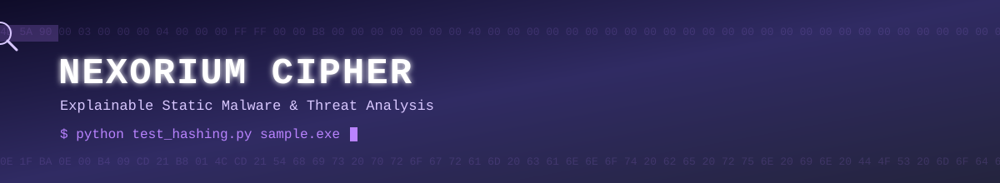
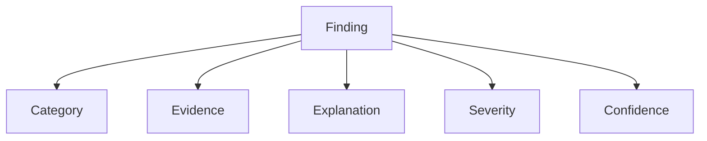
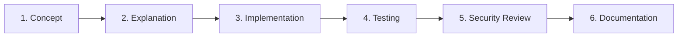

<p align="center">
  
</p>

<p align="center">
  
</p>

<p align="center">
  
  
  
</p>

<p align="center">
  
  
  
  
  
  
</p>

<p align="center">
  Nexorium-Cipher is a multi-platform static threat and malware analysis toolkit focused on <b>explainable security findings</b>.
</p>

---

## 📑 Table of Contents

- [📖 Overview](#overview)
- [🚦 Current Status](#current-status)
- [💻 Example](#example)
- [🏗️ Project Architecture](#project-architecture)
- [🧩 Explainable Findings](#explainable-findings)
- [🗂️ Planned Analysis Capabilities](#planned-analysis-capabilities)
- [🔮 Future Detection & Analysis](#future-detection--analysis)
- [🎓 Learning Objectives](#learning-objectives)
- [🧠 Development Philosophy](#development-philosophy)
- [🗺️ Roadmap](#roadmap)
- [⚠️ Disclaimer](#disclaimer)
- [📜 License](#license)

---

## 📖 Overview

The goal is simple:

> Give Cipher an unknown file and make it explain what the file is, what it contains, what it may be capable of, and why a finding may be suspicious.

Cipher is being developed incrementally as both a cybersecurity learning project and a practical security-analysis toolkit.

---

## 🚦 Current Status

### Phase 1 — Foundation

<p align="left">
         
</p>

The current implementation can calculate multiple hashes for a supplied file and detect common invalid inputs.

---

## 💻 Example

```
python test_hashing.py "C:\path\to\file.txt"
```

Example output:

```
File: C:\path\to\file.txt
MD5: ...
SHA-1: ...
SHA-256: ...
```

Invalid input is handled cleanly:

```
ERROR: File not found.
```

or:

```
ERROR: The supplied path is a directory.
Please provide a file.
```

---

## 🏗️ Project Architecture

The project is being built as a modular analysis toolkit.

```
Nexorium-Cipher/
│
├── cipher/
│   └── core/
│       └── hashing.py
│
├── test_hashing.py
├── README.md
├── .gitignore
└── LICENSE
```

The architecture will expand as additional analysis capabilities are implemented.

---

## 🧩 Explainable Findings

A major design goal of Cipher is to avoid simply producing:

```
MALWARE: YES
```

Instead, Cipher should eventually produce structured findings containing:

```
Finding
├── Category
├── Evidence
├── Explanation
├── Severity
└── Confidence
```

*Visual summary of the same structure:*



For example:

| Field | Value |
|---|---|
| Finding | Dynamic code loading |
| Evidence | `DexClassLoader` |
| Explanation | The application contains an API capable of dynamically loading executable code. |
| Severity | 🔴 HIGH |
| Confidence | 🟢 HIGH |

This approach is intended to make analysis results easier to understand and investigate.

---

## 🗂️ Planned Analysis Capabilities

The project will eventually expand to support multiple file and application formats.

<details>
<summary><b>🌐 Web / JavaScript</b></summary>
<br/>

- HTML analysis
- JavaScript analysis
- External URLs
- Redirect indicators
- Suspicious JavaScript constructs
- Credential collection indicators
- Obfuscation detection
- Network communication indicators

</details>

<details>
<summary><b>🤖 Android APK</b></summary>
<br/>

- Android Manifest analysis
- Permissions
- Activities
- Services
- Broadcast receivers
- Exported components
- DEX analysis
- Native libraries
- Certificates
- Package metadata
- URLs and domains
- Suspicious APIs
- Obfuscation indicators
- Dynamic code loading indicators

</details>

<details>
<summary><b>🪟 Windows PE</b></summary>
<br/>

- PE headers
- Sections
- Imports / exports
- Resources
- Strings
- Entropy
- Digital signatures
- Suspicious APIs
- Packer indicators

</details>

<details>
<summary><b>🐧 Linux ELF</b></summary>
<br/>

- ELF headers
- Sections
- Symbols
- Shared libraries
- Strings
- Imports
- Suspicious functions

</details>

---

## 🔮 Future Detection & Analysis

Future versions are planned to include:

<p align="left">
           
</p>

Dynamic analysis may be introduced later using isolated environments such as dedicated virtual machines or Android emulators.

Unknown or potentially malicious samples should **never be executed on a normal everyday system**.

---

## 🎓 Learning Objectives

Nexorium-Cipher is also a hands-on cybersecurity learning project.

Topics covered during development include:

<table>
<tr><td width="50%">

- Hashing
- Cryptography
- Encryption vs hashing
- Encoding
- File formats
- File fingerprints
- Static analysis
- Dynamic analysis
- Malware triage
- Indicators of Compromise

</td><td width="50%">

- Evidence analysis
- Risk scoring
- Confidence scoring
- Obfuscation
- Packing
- Persistence concepts
- Network indicators
- False positives and false negatives
- Safe malware-analysis practices
- Git and GitHub project management

</td></tr>
</table>

A complete reference document will be created during development to document the concepts learned and provide a quick revision guide.

---

## 🧠 Development Philosophy

Cipher is intentionally being developed **one capability at a time**.

Each feature is designed to include:

1. Cybersecurity concept
2. Technical explanation
3. Python implementation
4. Testing
5. Security considerations
6. Documentation

*Visual summary of the same pipeline:*



The objective is to understand how each component works rather than simply assembling existing tools.

---

## 🗺️ Roadmap

<p align="left">

</p>

<details open>
<summary><b>✅ Phase 1 — Foundation</b> &nbsp;</summary>
<br/>

- [x] Project initialization
- [x] Hashing engine
- [x] MD5 / SHA-1 / SHA-256
- [x] Chunked file hashing
- [x] CLI file input
- [x] Basic path validation
- [x] Basic error handling

</details>

<details>
<summary><b>🔜 Planned / Upcoming</b> &nbsp;</summary>
<br/>

- [ ] File identification
- [ ] Metadata extraction
- [ ] Evidence engine
- [ ] Web / JavaScript analyzer
- [ ] Archive analyzer
- [ ] APK analyzer
- [ ] PE analyzer
- [ ] ELF analyzer
- [ ] IOC extraction
- [ ] Risk engine
- [ ] JSON reporting
- [ ] HTML reporting
- [ ] Dynamic analysis
- [ ] Static + dynamic evidence correlation

</details>

---

## ⚠️ Disclaimer

Nexorium-Cipher is intended for **educational, defensive, and authorized security analysis**.

Only analyze files and systems that you own or have explicit permission to analyze.

Potentially malicious samples should be handled in isolated environments with appropriate safety precautions.

---

## 📜 License

This project is licensed under the **MIT License**.

---

## 👤 Author

<p align="center">
<b>Daniyal Janjua</b><br/>
Cybersecurity Student · SOC Analyst Aspirant
</p>

<p align="center">
  <a href="https://github.com/daniyal-sec">
    
  </a>
  <a href="https://github.com/daniyal-sec">
    
  </a>
</p>

<p align="center">
  <sub>Static Malware Analysis · Hashing · Explainable Security Findings</sub>
</p>